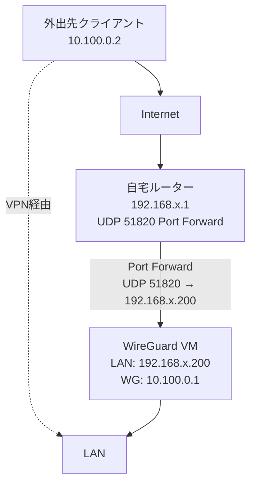
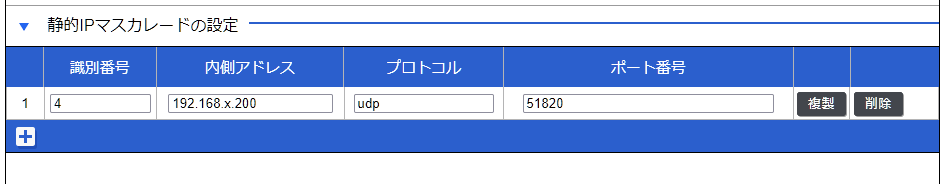
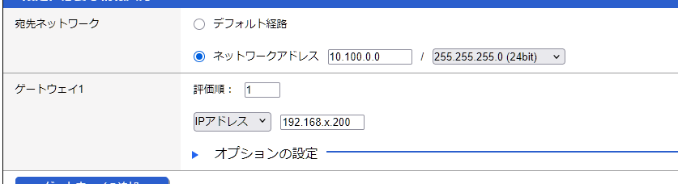

外出先から自宅内のLAN環境にアクセスしたいパターンがしばしばあります

IPsecとか導入できなくはないですが今後の運用とかを考えると大変そうなので、噂のWireGuardを導入したときの手順メモです

※Proxmoxと書いてありますが、設定内容等で困ることは無かったです


## 全体イメージ

至ってシンプルですが、イメージとしてはこんな感じです

WireGuardを踏み台にしてLANにアクセスします

今回WireGuardのVMは`192.168.x.200`のIPアドレスを振るよう事前にDHCPで設定しました

Clientは`192.168.x.x`のアクセスのみVPNを通してLANにアクセスするようにします



## 環境
L3スイッチを運用している場合、そちらの設定もしてください
- Proxmox VE 9.2.18
- RTX1300

また、Proxmox環境下でVMを建て、最低限で動作させます

最低限のスペックで動作は問題ないようです

|||
|---|---|
|OS | Debian 13|
|CPU | 1 vCPU|
|RAM | 512MB|

Debianの初期セットアップは別を参照してください


## WireGuardセットアップ
Debian Wikiの[WireGuard](https://wiki.debian.org/WireGuard)ページを参考にして作業を進めます

### 必要なものをインストール
```bash
$ sudo apt update && sudo apt install wireguard
$ wg --version
wireguard-tools v1.0.20210914 - https://git.zx2c4.com/wireguard-tools/
```

### キーペアの生成

`umask 0077`を付けてアクセス権を制限するのが良いらしい

クライアント用キーペアも同様ですが、ファイル名は判別できれば何でも良いです
```bash
$ sudo -i

$ cd /etc/wireguard

$ umask 0077 && wg genkey | tee server.key | wg pubkey > server.pub
wireguard-tools v1.0.20210914 - https://git.zx2c4.com/wireguard-tools/

```

### クライアント用キーペアの生成
同様に`/etc/wireguard`でクライアントで使用するキーも生成します

また、PresharedKeyで追加防御します

念のため
```bash
$ umask 0077 &&  wg genkey | tee client1.key | wg pubkey > client1.pub

$ umask 0077 && wg genpsk > client1.psk
```

### WireGuardのConfigを変更する
`/etc/wireguard/wg0.conf`を生成して以下を追記します

**PrivateKey, PublicKeyは生成したキーを直接書きます(1敗)**

||参照ファイル|
|---|---|
| SERVER_PRIVATE_KEY | /etc/wireguard/server.key |
| CLIENT_PUBLIC_KEY | /etc/wireguard/client1.pub |
| PRESHARED_KEY | /etc/wireguard/client1.psk |
```plaintext {filename="/etc/wireguard/wg0.conf"}
[Interface]
Address = 10.100.0.1/24
ListenPort = 51820
PrivateKey = SERVER_PRIVATE_KEY

[Peer]
PublicKey = CLIENT_PUBLIC_KEY
PresharedKey = PRESHARED_KEY
AllowedIPs = 10.100.0.2/32
```
    
- また、作成したconfファイルの権限も変更しておきます
```bash
$ chmod 600 /etc/wireguard/wg0.conf

$ ls -lha
total 28K
drwx------  2 root root 4.0K Sep 10 15:41 .
drwxr-xr-x 69 root root 4.0K Sep 10 04:55 ..
-rw-------  1 root root   45 Sep 10 15:35 client1.key
-rw-------  1 root root   45 Sep 10 15:35 client1.psk
-rw-------  1 root root   45 Sep 10 15:35 client1.pub
-rw-------  1 root root   45 Sep 10 07:11 server.key
-rw-------  1 root root   45 Sep 10 07:11 server.pub
-rw-------  1 root root  168 Sep 10 15:41 wg0.conf
```

### IP forwarding設定
システムが他ネットワークにパケットを転送するために必要とのこと

`$ sudo vi /etc/sysctl.d/70-wireguard.conf`で、以下を追記します
```plaintext {filename="/etc/sysctl.d/70-wireguard.conf"}
net.ipv4.ip_forward=1
```
 - 最後に反映します
```bash
$ sudo sysctl --system

$ sysctl net.ipv4.ip_forward
net.ipv4.ip_forward = 1
```

### nftablesの設定
`iifname "wg0" accept`でVPN側の端末ならホストにフルアクセスできるので、公開する場合は注意してください

- 事前にNICを確認します
    - 今回の場合は`ens18`
```bash
$ ip a

1: lo: <LOOPBACK,UP,LOWER_UP> mtu 65536 qdisc noqueue state UNKNOWN group default qlen 1000
    link/loopback 00:00:00:00:00:00 brd 00:00:00:00:00:00
    inet 127.0.0.1/8 scope host lo
       valid_lft forever preferred_lft forever
    inet6 ::1/128 scope host noprefixroute
       valid_lft forever preferred_lft forever
2: ens18: <BROADCAST,MULTICAST,UP,LOWER_UP> mtu 1500 qdisc fq_codel state UP group default qlen 1000
...(以下略)
```
- `sudo vi /etc/nftables.conf`からnftablesの設定変更します
```plaintext {filename="/etc/nftables.conf"}
#!/usr/sbin/nft -f

flush ruleset

table inet filter {
    chain input {
        type filter hook input priority 0;
        policy drop;

        iif "lo" accept

        ct state established,related accept

        iifname "ens18" ip saddr 192.168.x.0/24 accept

        iifname "ens18" udp dport 51820 accept

        iifname "wg0" accept

        ip protocol icmp accept
    }

    chain forward {
        type filter hook forward priority 0;
        policy drop;

        ct state established,related accept

        # VPN -> LANのみ
        iifname "wg0" oifname "ens18" \
            ip saddr 10.100.0.0/24 \
            ip daddr 192.168.x.0/24 accept
    }

    chain output {
        type filter hook output priority 0;
        policy accept;
    }
}
```
- 問題なければ適用します
```bash
$ sudo nft -c -f /etc/nftables.conf

$ sudo systemctl enable --now nftables
Created symlink '/etc/systemd/system/sysinit.target.wants/nftables.service' -> '/usr/lib/systemd/system/nftables.service'.

$ sudo nft list ruleset
table inet filter {
        chain input {
                type filter hook input priority filter; policy drop;
                iif "lo" accept
                ct state established,related accept
                iifname "ens18" ip saddr 192.168.x.0/24 accept
                iifname "ens18" udp dport 51820 accept
                iifname "wg0" accept
                ip protocol icmp accept
        }

        chain forward {
                type filter hook forward priority filter; policy drop;
                ct state established,related accept
                iifname "wg0" oifname "ens18" ip saddr 10.100.0.0/24 ip daddr 192.168.x.0/24 accept
        }

        chain output {
                type filter hook output priority filter; policy accept;
        }
}
```

### WireGuardを起動
もし起動時にエラーが出た場合は以前の手順を確認してください(一応Public key周りは隠してます)

`ip a`でIPアドレスが設定しているIPアドレスなことを確認します
```bash
$ sudo systemctl enable --now wg-quick@wg0

$ sudo wg
interface: wg0
  public key: xxxxxxxxxxxxxxxxxxxxxxxxxxxxxxxxxxxxxxxxxxxx
  private key: (hidden)
  listening port: 51820

peer: xxxxxxxxxxxxxxxxxxxxxxxxxxxxxxxxxxxxxxxxxxxx
  allowed ips: 10.100.0.2/32

$ ip a show wg0
7: wg0: <POINTOPOINT,NOARP,UP,LOWER_UP> mtu 1420 qdisc noqueue state UNKNOWN group default qlen 1000
    link/none
    inet 10.100.0.1/24 scope global wg0
       valid_lft forever preferred_lft forever
```

### ルーターのポートフォワード
外部からUDP 51820へのアクセスは、今回作成したVMへフォワーディングするように設定します

今回はRTX1300のWEBから設定しました


またVPN Client側へパケットを返す時、転送先が迷子になるので静的ルートも設定します


### クライアントの設定
今回はiPhoneからアクセスできるよう設定します

アプリはストアにあると思うので、事前にダウンロードしておいてください

[WireGuardのConfigを変更する](#wireguardのconfigを変更する)
    で作成したファイルっぽい内容のファイルを作成し、アプリ内で読み込ませればコネクションが確立できます
||参照ファイル|
|---|---|
| CLIENT_PRIVATE_KEY | /etc/wireguard/client1.key |
| SERVER_PUBLIC_KEY | /etc/wireguard/server.pub |
| PRESHARED_KEY | /etc/wireguard/client1.psk |

```plaintext {filename="client.conf"}
[Interface]
PrivateKey = CLIENT_PRIVATE_KEY
Address = 10.100.0.2/24

[Peer]
PublicKey = SERVER_PUBLIC_KEY
Endpoint = your-public-ip.example:51820
PresharedKey = PRESHARED_KEY
AllowedIPs = 10.100.0.0/24, 192.168.x.0/24
PersistentKeepalive = 25
```

完成したファイルをGoogle Driveなどで送信して読み込ませた後、セルラー回線でLANからアクセスできるか確認できれば完了です

`qrencode`等でQR生成してから読み込ませることも可能で、こっちのほうが楽かもしれません

## おわりに
自宅環境下では複雑なことはしていないので、かなり簡単に導入できたと思います

多分、ゴリゴリにネットワーク組んでいても面倒なことしなくても良いような気がします